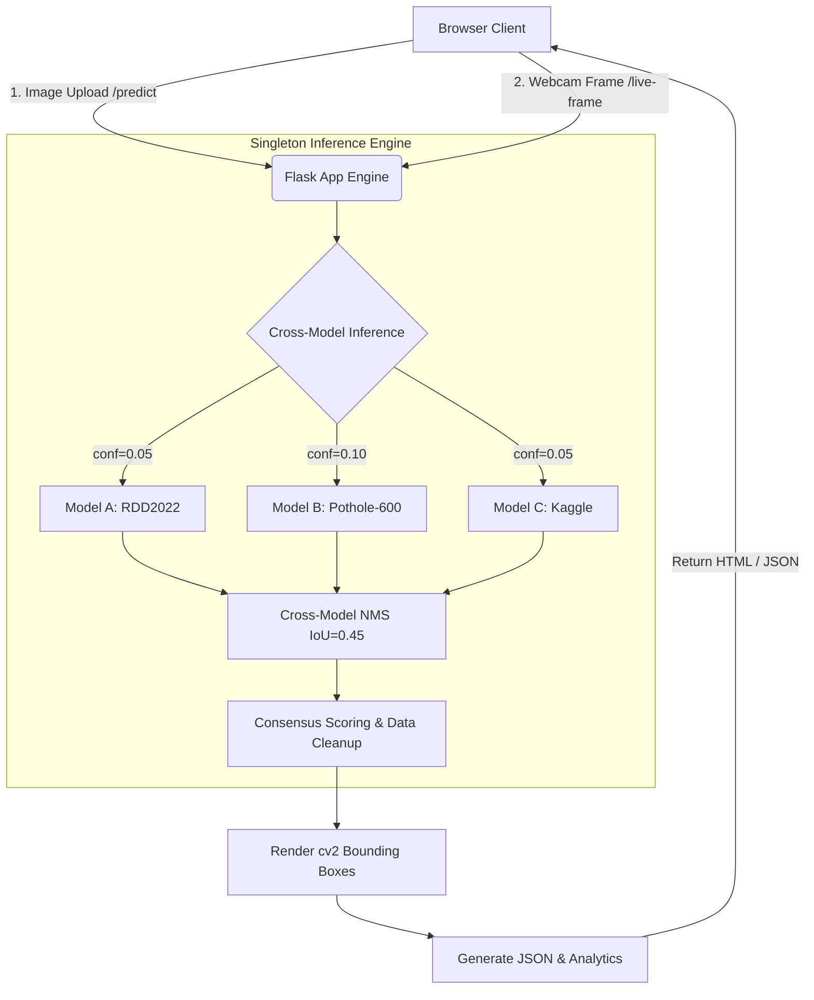

<div align="center">


[](#) 
[](#license) 
[](#-deployment) 

[](#tech-stack)
[](#tech-stack)
[](#tech-stack)
[](#tech-stack)


</div>

---

## 📖 Overview

**Road Damage AI** is an advanced, multi-model ensemble pipeline built for scalable road quality inspection. It upgrades standard single-model pothole detection by running an ensemble of **three specialized YOLOv8 models** simultaneously. 

By combining models trained on different points of view (Dashcam, Close-up, Street-level) using a cascaded transfer-learning strategy, the application achieves incredible recall and utilizes **Cross-Model Non-Maximum Suppression (NMS)** to track multi-model consensus and filter out false positives.

Users can interface with the AI pipeline via a **Server-Side Rendered Image Upload Dashboard** or a **Live Camera Feed** that runs inference every 2 seconds without requiring client-side GPU power.

---

## ✨ Key Features

| ✅ | Capability |
| --- | --- |
| 🤖 | **3-Model YOLOv8 Ensemble:** RDD2022 (Dashcam), Pothole-600 (Close-up), Kaggle (Street). |
| 🛡️ | **Consensus Tracking:** Overlapping bounding boxes are merged via cross-model NMS (IoU=0.45). Detections flagged by 2+ models earn a high-confidence consensus star. |
| 📡 | **Live Camera Detection:** Uses the `MediaStream API` to capture webcam frames entirely in the browser, passing base64 JPEG blobs to `/api/live-frame` for seamless JS-driven live tracking. |
| 📊 | **Damage Analytics:** Calculates cumulative damage counts and real-time damage area percentages. |
| 🎨 | **Premium Dark-Mode UI:** Glassmorphism accents, live statistics counting, dynamic color-coded bounding boxes (🔴 Model A, 🟢 Model B, 🔵 Model C). |
| 🚀 | **Production-Ready:** Optimized with `gunicorn` (1 worker) so all 3 models load only once into memory, perfectly tuned for Render's free tier. |

---

## 🏗️ Architecture



---

## 📁 Project Structure

```
📦 Pothole-AI-System
├─ app/
│  ├─ app.py                  # Core Flask routing & JSON APIs
│  ├─ RoadDamageAI_Phase1/    
│  │  └─ weights/             # 3 specialized YOLOv8 models
│  │     ├─ model_a_rdd2022.pt
│  │     ├─ model_b_pothole600.pt
│  │     └─ model_c_kaggle.pt
│  ├─ utils/
│  │  └─ detector.py          # Array/Disk inference & NMS logic
│  ├─ static/
│  │  ├─ js/live_cam.js       # Webcam stream & API sync
│  │  ├─ styles.css           # Global Dark Theme UI
│  │  ├─ uploads/             # Ephemeral image uploads
│  │  └─ results/             # Annotated output storage
│  └─ templates/
│     ├─ landing.html         # Hero page
│     ├─ dashboard.html       # Mode Selector (Live vs Upload)
│     ├─ index.html           # Upload Interface
│     └─ result.html          # Detailed tabular analytics
├─ notebook/
│  └─ Road_Damage_MultiModel_Pipeline_final.ipynb # Source training
├─ requirements.txt           # Dependencies
├─ Procfile                   # Gunicorn config for Render
└─ render.yaml                # Render Infrastructure-as-Code
```

---

## ⚡ Quick Start

### Prerequisites
- Python 3.10+
- `gunicorn` (for Unix environments)

### Local Installation

1. **Clone and Setup Virtual Environment:**
   ```bash
   git clone https://github.com/<your-username>/Pothole-AI-System.git
   cd Pothole-AI-System
   python -m venv .venv
   source .venv/bin/activate  # Windows: .venv\Scripts\activate
   pip install -r requirements.txt
   ```

2. **Ensure Weights Are Present:**
   Store your 3 trained YOLOv8 `.pt` models in `app/RoadDamageAI_Phase1/weights/`. 

3. **Run the Development Server:**
   ```bash
   cd app
   python app.py
   # Visit http://127.0.0.1:5000 in your browser
   ```

---

## 🚀 Deployment (Render)

This project includes a `Procfile` and `render.yaml` for one-click deployment on Render.

**Important Note regarding Render's Free Tier:** 
The application restricts `gunicorn` to `--workers 1`. This is done intentionally because keeping three YOLO models in memory consumes ~66MB, and spinning up multiple workers on a 512MB RAM free instance will cause out-of-memory (OOM) crashes.

To deploy:
1. Connect this repo to Render.
2. The `render.yaml` blueprint will automatically detect the settings.
3. Access your live app!

---

## 🖼️ Screenshots / Demo


---

## 🗺️ Roadmap (Phase 2 & 3)

- [ ] **Phase 2 — Severity Classification:** Train an additional CNN to classify the detected bounding boxes by severity (Small / Medium / Severe).
- [ ] **Phase 3 — Location Intelligence:** Implement GPS EXIF extraction for image uploads and browser Geolocation API for the live camera to build dynamic pothole maps.
- [ ] **DB Integration:** Migrate to PostgreSQL for maintaining historic detection logs.

---

## 🤝 Contributing

1. Fork the repo
2. Create a feature branch (`git checkout -b feature/awesome`)
3. Commit changes (`git commit -m 'Add awesome feature'`)
4. Push to branch (`git push origin feature/awesome`)
5. Open a Pull Request

---

## 📜 License & Acknowledgments

- Distributed under the MIT License.
- Built using **Ultralytics YOLOv8**.
- Datasets utilized: RDD2022, Pothole-600, Kaggle Pothole Dataset.

<div align="center">


</div>
